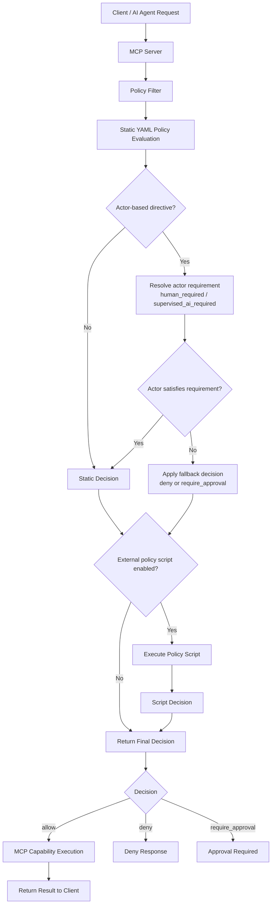

# MCP Policy Filter

A lightweight **Policy Enforcement Point (PEP)** for Model Context Protocol (MCP) servers that enables policy-as-code governance of MCP capabilities.

This project demonstrates a simple and extensible approach for
**governing MCP capability execution** using a combination of:

-   **Static YAML policy configuration**
-   **Optional external policy scripts**
-   **Identity-aware execution context**

The design allows organizations to implement **policy-as-code for MCP
servers** without modifying the MCP implementation itself.

It is intended as a **reference architecture** that can be adopted by
MCP server implementations, gateways, or containerized deployments.

------------------------------------------------------------------------

## Author’s note
The core ideas, architecture and overall direction of this project are entirely mine and based on my personal experience.
This is a completely personal and independent project and has no official endorsement, support or involvement from SUSE.
The implementation (code) was developed with AI assistance under my supervision for rapid prototyping and demonstration purposes only.

**Important disclaimer**:  
This is an **experimental, uncurated and unproven reference implementation**. It has not been thoroughly tested, is not validated for production use, and comes with **no guarantees** of correctness, security, stability or performance. Use it at your own risk and for educational/demonstration purposes only.

------------------------------------------------------------------------

# Overview

MCP servers expose capabilities such as:

-   tools
-   resources
-   prompts

These capabilities may execute operations that affect infrastructure, data access, or system state.

The **MCP Policy Filter** introduces a policy layer that evaluates
requests **before the capability is executed**.

For the full design rationale, architecture discussion, and illustrative implementation details, see the full proposal document in this repository.

------------------------------------------------------------------------

# Why This Exists

Current MCP security approaches often rely on external gateways, centralized policy engines, or client-side controls. These approaches are useful, but they operate outside the execution layer of the MCP server.

This project explores a complementary model: a lightweight **server-side policy enforcement hook** evaluated locally before an MCP capability is executed.

This provides several advantages:

- **Execution-point enforcement**  
  Policy is enforced where the action actually happens, not only at the network boundary.
- **Defense in depth**  
  Local enforcement still applies even if a gateway is bypassed, misconfigured, or absent.
- **Operational simplicity**  
  A small static YAML policy can handle common cases, while an optional external script supports advanced logic.
- **Offline and air-gapped support**  
  The model works in disconnected environments without requiring a centralized policy service.
- **Customer-controlled governance**  
  Organizations can implement their own authorization, auditing, approval, or identity logic without changing MCP server code.
------------------------------------------------------------------------

# Key Features

## Static Policy Configuration

Policy rules are defined declaratively in YAML.

This allows administrators to control:

-   which capabilities are visible
-   which capabilities may execute
-   which operations require approval
-   actor-based restrictions

## Optional Dynamic Policy Script

For advanced scenarios, the wrapper can invoke an external policy script
that receives the request context and returns a decision.

This enables:

-   identity-aware policy decisions
-   integration with external systems
-   approval workflows
-   organization-specific governance logic

## Actor-Based Governance

The policy model includes lightweight directives such as:

    human_required
    supervised_ai_required

These enable simple **Human-in-the-Loop (HITL)** governance patterns.

## Deployment Flexibility

The policy enforcement hook may be integrated as:

-   part of the MCP server
-   a server launcher
-   a lightweight wrapper
-   a container entrypoint

This allows the model to work across:

-   bare-metal Linux systems
-   virtual machines
-   containerized MCP servers
-   orchestrated platforms such as Kubernetes

------------------------------------------------------------------------

# Architecture

The policy filter follows a common **Policy Enforcement Point (PEP)**
pattern used in systems such as:

-   Kubernetes admission controllers
-   service mesh authorization policies
-   policy-as-code frameworks such as Open Policy Agent (OPA)

The filter evaluates the request **before capability execution**.

Example flow:

    Request Received
           │
           ▼
    Static YAML Policy Evaluation
           │
           ▼
    Actor Requirement Resolution
           │
           ▼
    Optional External Policy Script
           │
           ▼
    Final Decision

    


This ensures policy enforcement happens **locally and before
execution**.

------------------------------------------------------------------------

# Policy Decision Model

Policy evaluation returns one of the following decisions:

  Decision           Meaning
  ------------------ ---------------------------------
  allow              request may proceed
  deny               request must be blocked
  require_approval   request requires human approval

Actor-based directives may also appear in static configuration or script
responses:

  Directive                Meaning
  ------------------------ -------------------------------------------
  human_required           only human actors may execute
  supervised_ai_required   human or supervised AI actors may execute

These directives are resolved by the wrapper using
`identity_context.actor_type`.

------------------------------------------------------------------------

# Policy Configuration Example

Example YAML policy:

``` yaml
permissions:

  tool.delete_volume:
    tools/list: allow
    tools/call: require_approval

  resource.server_metrics:
    resources/list: allow
    resources/read: allow

default_policy:

  tools/list: deny
  tools/call: deny

  resources/list: deny
  resources/read: deny

  prompts/list: deny
  prompts/get: human_required

  other: deny
```

The policy fallback model is:

1.  `permissions.<capability>.<method>`
2.  `default_policy.<method>`
3.  `default_policy.other`

------------------------------------------------------------------------

# External Policy Script

When enabled, the wrapper may call an external script that receives
request context:

``` json
{
  "request_context": {
    "mcp_context": {
      "method": "tools/call",
      "name": "tool.delete_volume"
    },
    "identity_context": {
      "actor_type": "human"
    }
  }
}
```

The script returns a decision:

``` json
{
  "decision": "allow",
  "reason": "User is member of storage-admin group"
}
```

This allows integration with:

-   LDAP or directory services
-   external policy engines
-   governance dashboards
-   approval systems

------------------------------------------------------------------------

# Repository Structure

    mcp-policy-filter/
    │
    ├── wrapper/
    │   └── mcp_policy_wrapper.py
    │
    ├── examples/
    │   └── policy.yaml
    │
    └── README.md

------------------------------------------------------------------------

# Example Use Cases

This model can support a variety of governance scenarios.

## Capability Visibility Control

Hide sensitive tools from `tools/list` while still allowing controlled
execution.

## Human-in-the-Loop Operations

Require human approval for destructive actions.

## AI Governance

Restrict certain capabilities to human operators or supervised agents.

## Enterprise Policy Integration

Use external scripts to integrate with:

-   identity providers
-   approval workflows
-   security policy engines

------------------------------------------------------------------------

# Security Considerations

The policy script receives **identity attributes** rather than
authentication credentials.

This allows authorization decisions without exposing:

-   tokens
-   passwords
-   session secrets

Deployments may optionally execute the policy script within a restricted
environment such as an SELinux confinement domain.

------------------------------------------------------------------------

# Status

This repository provides a **reference architecture and illustrative
implementation** of a server-side policy enforcement model for MCP servers.

It demonstrates how MCP servers can integrate a simple policy
enforcement layer without modifying the MCP protocol itself.

------------------------------------------------------------------------

# Author

Sebastian Martinez

LinkedIn: https://www.linkedin.com/in/sebastianmartinezt/

------------------------------------------------------------------------

# License

MIT License
