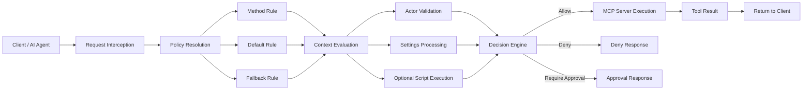

# MCP Policy Filter

A configurable policy enforcement wrapper for MCP servers.

The **MCP Policy Filter** introduces a lightweight policy layer that intercepts MCP tool and method invocations and evaluates them against configurable rules before execution.

The filter allows organizations to define **governance, safety, and operational policies** controlling which actions AI systems may perform.

Policy decisions can result in:

* **allow** – request proceeds normally
* **deny** – request is blocked
* **require_approval** – request requires human approval

Policies are defined declaratively using **YAML configuration** and may optionally delegate complex logic to external scripts.

---

# Overview

Modern AI systems increasingly interact with external tools through MCP servers.
While this provides powerful capabilities, it also introduces risks such as:

* unauthorized tool usage
* unsafe script execution
* policy violations
* lack of human oversight

The MCP Policy Filter provides a **simple and extensible policy enforcement layer** that evaluates requests **before the underlying tool executes**.

This approach enables organizations to implement governance controls without modifying the underlying MCP server.

---

# Key Features

* YAML-based policy configuration
* Method-level and default rules
* Optional external policy scripts
* Actor-aware policy decisions
* Human-in-the-loop approval workflows
* Lightweight wrapper architecture
* Structured policy decision responses

---

# Architecture

The policy filter acts as a **wrapper around MCP method execution**.



The wrapper performs **pre-execution evaluation**, ensuring that requests are validated before reaching the underlying tool.

---

# Example Policy Configuration

```yaml
permissions:

  tools.run_script:
    allow: false
    human_required: true

  tools.list_files:
    allow: true

default:
  allow: true
```

This configuration:

* blocks script execution unless a human is involved
* allows file listing
* allows other operations by default

---

# Policy Decision Model

Policy evaluation returns a structured response.

Example:

```json
{
  "decision": "deny",
  "reason": "script_execution_not_allowed",
  "metadata": {
    "method": "tools.run_script"
  }
}
```

Possible decisions:

* `allow`
* `deny`
* `require_approval`

Optional metadata may provide context for logging or auditing.

---

# Example Wrapper Logic (Simplified)

```python
def evaluate_request(method, actor, policy):

    rule = policy.get("permissions", {}).get(method)

    if not rule:
        rule = policy.get("default")

    if rule.get("human_required") and not actor:
        return {"decision": "require_approval"}

    if not rule.get("allow", False):
        return {"decision": "deny"}

    return {"decision": "allow"}
```

This example demonstrates the core concept of resolving policy rules before execution.

---

# Repository Structure

```
docs/
    architecture.md
    policy-model.md

examples/
    policy.yaml
    wrapper_example.py
    policy_script_example.py

diagrams/
    wrapper-flow.mmd
    policy-flow.mmd
```

---

# Use Cases

The MCP Policy Filter can be used for:

* AI tool governance
* secure execution of external scripts
* restricting sensitive tool operations
* implementing human approval workflows
* enforcing organizational policies for AI agents

---

# Design Principles

The design follows several principles:

**Simplicity**

The policy model should be easy to understand and implement.

**Extensibility**

Policies may optionally delegate logic to external scripts.

**Separation of Concerns**

The wrapper handles policy enforcement while the MCP server continues to provide tool functionality.

**Minimal Intrusion**

The approach does not require modification of existing MCP tools.

---

# Status

This project currently provides:

* architectural model
* policy configuration examples
* reference implementation patterns

It is intended as a **reference architecture for MCP policy enforcement**.

---

# License

This project is licensed under the **MIT License**.

See the `LICENSE` file for details.

---

# Contributing

Contributions, improvements, and discussion are welcome.

Possible areas for extension include:

* additional policy evaluation strategies
* integrations with approval systems
* policy auditing and logging frameworks
* extended policy schemas

---

# Author

Sebastian Martinez sebastianmart@gmail.com
Project created as an exploration of **policy governance mechanisms for MCP tool execution**.
